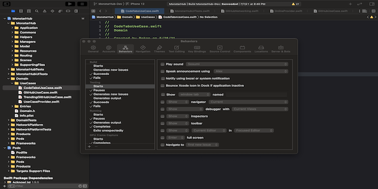

# TinkerTools
A list of handful tips and utility apps for Pros. Let the tool to do work so that we can focus more on coding.

#### Open Terminal from Xcode:
 1. Create a bash script and save it in some folder. If you are lazy like me [here’s the gist](https://gist.github.com/rokon-mlbd/1711e874b12f3707a18115367330f059), download and use it:
>  #!/bin/bash
>  
> open -a Terminal "`pwd`"

 2. Make script executable by running this script from Terminal: `chmod +x /path/to/the/open_terminal.sh`
 3. Go to Xcode Preferences. Add a new Behavior by clicking the `+` button in the bottom left corner. Name it and give a shortcut key. In my case `⌘+⌥+⌃+⇧+T`
 
 4. On the right side details pane check the Run option. From the adjacent drop-down menu choose the script you just saved in step 1.

 > If you use iTerm, replace `Terminal` with `iTerm` in `open -a Terminal "pwd"`

After becoming accustomed to the ease of opening terminal from Xcode, I have created two more shortcuts. One to [show project](https://gist.github.com/rokon-mlbd/d552c466999953f96b8e96215ee11ab7) in finder and another one is to open [Derived Data folder](https://gist.github.com/rokon-mlbd/a1382b9015cf7f5401ae93bdd1ac3a0b) from Xcode. The steps are the same as above.

#### Debugging with BurpSuite

[Burp Suite](https://portswigger.net/burp/communitydownload) allows manual testers to intercept all requests and responses between the browser and the target application, even when HTTPS is being used.

#### DevCleaner

Xcode could store tens of gigabytes in ~/Developer folder. Most of those cached files & symbols is not reclaimed over time and could consume a large amount of your storage, which is especially important if you have relatively small SSD drive.
[DevCleaner](https://github.com/vashpan/xcode-dev-cleaner) gives you an easy way to inspect auto-generated files and clean them if necessary. It could also remind you about scan after a while.

#### #Dropover

[Dropover](https://dropoverapp.com) is a macOS utility that makes Drag and Drop easier. Use it to stash, gather or move any draggable content without having to open side-by-side windows.

#### Flycut

[Flycut](https://github.com/TermiT/Flycut) is a clean and simple clipboard manager for developers. It's based on an open source app called Jumpcut. On the Mac, every time you copy a code piece, Flycut stores it in history. Later, you can paste it using Shift-Command-V even if you have something different in your current clipboard. You can change the hotkey and other settings in preferences.

#### Rectangle

[Rectangle](https://rectangleapp.com) helps you to seemlessly move and resize windows in macOS using keyboard shortcuts or snap areas.

#### ProvisionQL - Quick Look for ipa & provision

[ProvisionQL](https://github.com/ealeksandrov/ProvisionQL) is inspired by a number of existing alternatives, the goal of this project is to provide clean, reliable, current and open source Quick Look plugin for iOS & macOS developers. Thumbnails will show app icon for .ipa/ .xcarchive or expiring status and device count for .mobileprovision. Quick Look preview will give a lot of information, including devices UUIDs, certificates, entitlements and much more.

#### TinkerTool

[TinkerTool](https://www.bresink.com/osx/TinkerTool.html) is an application that gives you access to additional preference settings Apple has built into macOS. This allows to activate hidden features in the operating system and in some of the applications delivered with the system.

#### CheatSheet

Just hold the ⌘-Key a bit longer to get a list of all active short cuts of the current application. It's as simple as that. [CheatSheet](https://www.mediaatelier.com/CheatSheet/) works hand in hand with CustomShortcuts from my friends at Houdah Software. This way, the shortcuts can be edited directly in CustomShortcuts with a click on the pen symbol.

#### ImageOptim

[ImageOptim](https://imageoptim.com/mac) removes bloated metadata. Saves disk space & bandwidth by compressing images without losing quality.

#### iTerm2

[iTerm2](https://iterm2.com) is a terminal emulator for macOS that does amazing things.

#### Oh My ZSH!

Unleash your terminal like never before. [Oh My Zsh](https://github.com/ohmyzsh/ohmyzsh) is a delightful, open source, community-driven framework for managing your Zsh configuration.

#### MacDown

[MacDown](https://macdown.uranusjr.com)  is an open source Markdown editor for macOS, released under the MIT License.

#### AltTab

[AltTab](https://alt-tab-macos.netlify.app) brings the power of Windows’s “alt-tab” window switcher to macOS.

#### FinderGo

[FinderGo](https://github.com/onmyway133/FinderGo) is a macOS app and Finder Sync Extension to open Terminal, iTerm, Hyper from Finder

#### Hidden Bar

[Hidden Bar](https://apps.apple.com/us/app/hidden-bar/id1452453066?mt=12) lets you hide menu bar items to give your Mac a cleaner look.

#### HotKey

[HotKey](https://apps.apple.com/us/app/hotkey-app/id975890633?mt=12) helps you to define keyboard shortcuts to launch Applications or to open folders in Finder.

#### Later

[Later](https://getlater.app) is a simple Mac app to clear and restore your workspace with ease.

#### Latest

[Latest](https://github.com/mangerlahn/Latest) is a small free utility app for the Mac that checks if all your apps are up to date including the apps that are not downloaded from App Store.

#### Lookin

[Lookin](https://lookin.work) is a free and Open-Source macOS App for iOS View Debugging. You can inspect and modify views in iOS app via Lookin, just like UI Inspector in Xcode.

#### MeetingBar

[MeetingBar](https://apps.apple.com/us/app/meetingbar/id1532419400?mt=12) shows your calendar events in the status bar. Create and join meetings in one click. Your meetings before your eyes!

#### Numi

[Numi](https://numi.app) is beautiful all in one calculator appfor Mac. Don't the name fool you. Numi is much more than a just calculator. Don't be affraid to give a try, you can thank me later.

#### Only Switch

[Only Switch](https://github.com/jacklandrin/OnlySwitch) provides a series of toggle switches to simplify your routine work, such as Hidden desktop icons, dark mode, and hide notch of the new Macbook Pro.

#### OnyX

[OnyX](https://www.macupdate.com/app/mac/11582/onyx) is a multifunction utility that you can use to verify the structure of the system files; run miscellaneous maintenance and cleaning tasks; configure parameters in the Finder, Dock, Safari, and some Apple applications; delete caches; remove certain problematic folders and files; rebuild various databases and indexes; and more.

#### Pure Paste

[Pure Paste](https://apps.apple.com/us/app/pure-paste/id1611378436?mt=12) lets you paste as plain text by default. It sits in the menu bar and clears formatting (fonts, colors, bold, links, tables, etc.) from the text you copy. However, it does not touch unrelated content like files, images, etc. It also ignores content copied from password managers.

#### Trailer

[Trailer](http://ptsochantaris.github.io/trailer/) accelerates your GitHub workflow. Never miss a comment again. Track pull requests and issues across repositories, directly in your Notification Center or on any device.
***